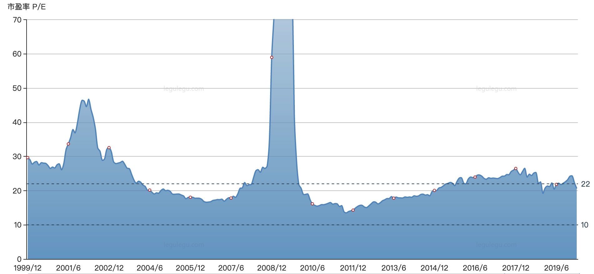
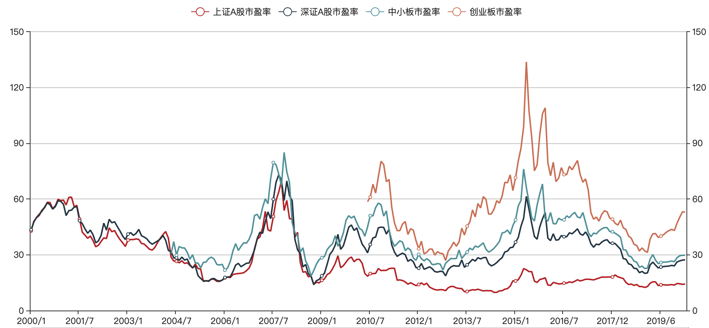

## 《投资学》（博迪 精简版）

### 第1、2章 投资学基本概念

首先是关于资产的定义。社会的物质财富取决于社会的产生能力，生产能力取决于社会的**实物资产**（Real Assets，如有形的建筑、设备、土地/无形的知识产权等）；与之相对应的就是**金融资产**（Financial Assets，如股票、债券等），它不能增加社会的生产能力，它只代表了对实物资产所产生的物质财富的索取权。

投资者拥有了一定的金融资产，就意味着金融资产的发行者拥有了一定的负债。真正的社会财富取决于实物资产，实物资产的表现决定了金融资产的价值。

投资者通常会同时投资实物资产和金融资产，比如既购买不动产，又持有股票和基金。

---

金融资产通常有三类：

1. **固定收益型**：即债务型证券，承诺支付一定的利息，比如国库券、银行存单、债券等。同是债务型证券，风险也是有高有低，比如国债风险就很低，而一些公司发行的债券风险相对就高。

2. **权益型**：代表对标的的所有权份额，比如公司的股票，它的收益和公司的经营状况相关。

3. **衍生品**：取决于其它资产的价格，比如期权、期货，主要作为风险管理工具来转移风险。

> 这些金融资产虽然不能直接创造财富，但是金融资产以及金融资产交易形成的金融市场，对繁荣社会财富有重要作用。这些作用包括：
> 
> * 资本优化配置，引导资金流向前景好的行业和公司
> * 储存财富，延迟消费
> * 引导不同风险偏好的投资者承担不同程度的风险（当然，收益也不同）
> * 公司所有权和经营权分离
> * 一些金融市场的制度安排可以提升公司治理（比如上市公司必须有一定的透明度，以免误导投资者）

金融资产的投资过程，就是构建符合自己需求的投资组合。这里主要需要投资者做出两步决策：第一步：**资产配置**（决定各种不同风险和收益的资产大类的比例，比如：一半投资低风险的货币基金、一半投资股票），第二步：**证券选择**（决定具体买哪几个货币基金、哪几支股票）。

---

金融资产的交易构成了金融市场。在金融市场中，个人的资产规模过小，直接进行投资通常比较困难，因此发展出各种**金融中介**。比如银行，吸收储户的存款然后放贷给公司（也就是投资给公司）；共同基金也类似，吸收个人投资者的资金进行各种投资。另外还有投资公司、保险公司等，这些都是主要从小投资者入手提供服务的中介。

投资银行则是服务于企业，帮助公司专门从事向公众发行证券的工作。投资银行负责在一级市场销售公司证券（此时投资银行就是公司的承销商），随后投资者可以在二级市场买卖一级市场发行的证券。
> * 一级市场：新证券发行的市场（发行市场）
> * 二级市场：已发行的证券流通的市场（流通市场）

某种程度上，金融资产对应了金融市场工具。比如股票是一种金融市场工具，投资人持有的股票就是相应的金融资产，但是对于股票发行的公司来说，这是一笔金融负债。
 
---

下面概述各种类型的金融市场（也就是可投资的金融资产的类型）：

1. 货币市场（Money Market，固定收益型）

	货币市场上的主要资产类型有国库券、定期存单、商业票据（短期无担保债务票据）、银行承兑汇票、回购协议等，货币市场总体来说风险很低。这些资产很多个人投资人是无法投资的，所以货币市场基金（Money Market Funds）成为对货币市场进行投资的主要途径，个人投资者可以通过购买货币市场基金份额来实现对货币资产的投资。
	
	货币市场基金的主要风险来源于系统性风险，2008 年雷曼兄弟倒闭导致其发行的商业票据无法兑现，货币基金 Reserve Primary Fund 的资产中配置了不到 1.5% 的雷曼兄弟商业票据，但投资人恐慌性地赎回导致基金规模锐减到三分之一，流动性枯竭，每份产品净值跌破 1 美元到 0.97 美元，这是历史上第一次。同时，其它主要的货币基金也遭到严重挤兑，为了避免进一步资金流出，美国财政部宣布将为货币基金提供联邦保险，相当于给货币基金提供类似银行的保险业务。
	
2. 债券市场（Bond Market，固定收益型）

	债券市场上的主要资产类型有中长期国债、国际债券、市政债券（地方政府债券）、公司债券、抵押贷款和抵押担保证券等，债券的风险主要来源于债券发行主体的违约风险。同样，债券市场基金（Bond Market Funds）是个人对债券市场进行投资的主要途径。
	
3. 股票市场（Stock Market，权益型）
	
	股票对应了某个公司的一部分所有权，其风险主要来源于公司的经营状况。投资股票的收益来源于两个方面，一方面是股利（股息、红利，优先股和普通股的派息、分红有不一样的设置），分配公司的经营利润；另一方面是资本利得（股价上涨带来的资本收益）。
	
	股票的市盈率（市价盈利比例，Price-Earnings Ratio，P/E）指当前股价与上一年每股收益的比值。一般市盈率越低，表明投资回收期越短，投资风险就越小，股票的投资价值就越大。
	
	最近20年的普标500市盈率变化：
	
	
	最近20年的A股市盈率变化：
	
	
4. 衍生工具市场（Derivatives Market，衍生品）

	期权、期货等金融工具也被称为衍生资产，其收益依赖于其它资产的价值，比如商品价格、股票价格、债券价格等。
	
---

市场指数（Index，或许叫指标可能更不容易引起歧义）是用一个计算数值来衡量某个市场的表现。最常见的是各种股票市场指数，如标普500（S&P 500）指数、威尔逊5000（Wilshire 5000）指数、上证综合指数、富时中国A50指数等等。

某一种股票市场指数，就是通过挑选一定的成分股，来反映市场的变化情况。不同的成分股挑选、以及不同的加权方式，代表了对市场某个方面的关切。

投资者完全可以复制某个指数的定义，来构建自己的投资组合，指数基金（Index Funds）就是这样做的。这是一种低成本的消极型投资策略，但很有效，比如标普500近 50 年的平均年收益率在 10% 左右，因为标普500的成分股涵盖了美国 500 多家顶级上市公司，约占美国股市总价值的80%，按标普500的定义来构建投资组合是一种很稳健的价值投资策略。

### 第3章 风险和收益

投资除了关注期望收益，关注风险同样重要。但因为风险的不确定性，以及风险很难直接观测，所以我们只能通过历史分析来推断过去的风险（这点常会被忽视，比如虽然很容易看一个投资产品的过往业绩，但是你无法直接观测某个时点其所持资产面临的风险）。

而且，即使分析了历史风险，也不代表未来也是如此，即使选取再长的历史时期进行分析，也无法保证历史中涵盖了未来可能发生的最好或最坏的情况，这就是**黑天鹅**问题。

以此看来，投资者需要对风险有足够的敬畏。

---

在投资决策中，利率水平是非常重要的一环。如果预计未来利率上升，那么投资者会更倾向于短期投资；反之如果预计未来利率会下降，那么投资者会倾向长期的固定利率储蓄。

研究利率首先要区分**名义利率**（R）和**实际利率**（r）。

以一年期的利率为例，如果名义利率 R 为 10%，也就是年初投资 100 块，年终得到 110 块，但是这一年过去后货币的购买力可能下降了，这个以通货膨胀率衡量，比如为 6%，也就是说 100 块能买到的东西，必须要 106 块才能买到，那么实际利率 r 是 (110 - 106)/106，比近似值 4% （10%-6%） 还要略低。

实际利率 r 理论上决定于资金的供需关系，如果实际利率提高，那么资金需求会减少（企业借贷的成本增加），资金供给会增加（居民会更倾向于推迟现时消费而进行储蓄）；反之也相反，这是一个动态平衡的过程。政府可以通过货币手段（如多发行货币，即增加通货膨胀率）或者财政手段（如增加预算赤字，即政府向市场借款导致未来利率期望的增加）来调整实际利率，从而调节资金供给和需求。

--

资产在不同持有期的收益率肯定是不同的，所以需要换算成某一常用期限的收益率，比如一年。

* 有效年利率（Effective Annual Rate，EAR）：一年期投资价值增长百分比（采用复利）
* 年化百分比利率（Annual Percentage Rate，APR）：将收益率按投资时长伸缩到一年期（不采用复利）

把投资时长记为 T，一年中有 n = 1/T 个复利周期 ，那么：1 + EAR = ( 1 + APR / n ) ^ n

假设年化利率 APR = 4%  
如果 T = 1， EAR = 4%  
如果 T = 1/12， EAR = 4.07%
如果 T = 1/365，EAR =  4.08%

显然，如果不同产品的 APR 相等，那么投资时长 T 越短越好。另外，当给定 EAR 但是投资时长 T 趋近于零时，这时候的 APR 的极限称为连续复利（Continuous Compounding），Rcc = ln( 1 + EAR )。

---

考虑一个 n 年的投资行为，如果不考虑复利的存在，那么收益率就是简单的算术平均值（ (A1+...+An)/n ）；但是如果考虑复利，那么收益率就应该从几何平均值（ (A1...An)^(1/n) ）进行推算。

比如投资了 100 块，经过5年投资期后的收益为 10 块，那么按算术平均值来算，年收益率应该是 2%；但是按几何平均值来计算，年收益率为 1.92%（1.1^0.2-1）。在收益率波动较大，特别是出现了负收益率的时候，两者的差异可能会比较大。比如第一年收益率为 -22%，第二年收益率为 28%，如果不考虑复利则年收益率为 3%；但如果考虑复利，那么收益率就几乎为 0% 了，显然，第一年赔钱后，后一年需要更高的收益率才能填平前一年的损失，因为本金变小了。

---

考虑投资一个指数基金，一年后每份基金的价格显然具有很大的不确定性，但是我们可以从历史数据中来评估一年后这个基金可能的状态，这个状态显然取决于历史数据的概率分布，从数据中可以得出收益的**期望值 E** 和**标准差 σ**，E 代表了收益的高低，σ 代表了收益的波动，也就是某种程度风险的度量。（但很显然，这不能完全代表风险，特别是未来的风险）

我们投资一个高风险的资产，肯定是希望得到更高的收益。那么，资产的收益率和无风险资产的收益率（比如银行存款利率）的差值，就是风险的溢价，称之为**超额收益**。这个超额收益的分布同样有期望值和标准差，这样我们就可以从概率分布上去定量地描述风险的溢价。

总结一下，评估收益和风险，可以把投资的收益率分解成无风险收益率和超额收益两部分，然后用概率分布来进行定量描述。

**夏普比率（Sharpe Ratio）**用来综合评估收益和风险，夏普比率 = 超额收益的期望值 / 超额收益的标准差。这个比率被广泛应用于评估投资经理的业绩，显然这个比率越高越好。

---

在关于超额收益的概率分布上，先假设其符合正态分布，后续也考虑了偏度分布、肥尾分布等。然后，用**在险价值（Value at Risk，VaR）**来度量一定概率下发生极端负收益造成的损失（就是分位数，比如 5% 的 VaR 就代表 95% 的收益率都大于该值）。

> 对超额收益的概率分布进行假设似乎并无必要，虽然从书中所举的历史数据似乎和正态分布拟合得不错，基金则采用肥尾分布假设，但是作者也提醒由于数据样本的稀缺导致概率分布模型存在潜在的风险。既然用 VaR 来衡量风险，那么超额收益的概率分布并不一定需要进行假设。由切比雪夫不等式我们就可以知道，对于任意的概率分布，位于期望值附近 k 个标准差范围内的概率总是大于 1 - 1/k^2。那么，5% 的 VaR 一定是位于 4.47 个标准差 σ 范围内的（而且计算还有富余，因为负收益只在期望值的左侧）。

