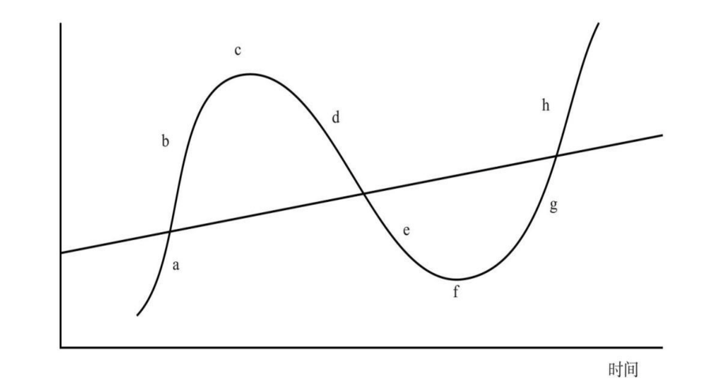

## 《周期》（霍华德·马克斯）

### 第1章 为什么投资要研究周期

作者开宗明义：我们是根本无法预知未来的“宏观面”会如何的，所谓的宏观面就是指未来的经济、市场、地缘政治等情况。

所以，有价值的研究应该投入到下面三个方面：

1. 基本面：包括行业基本面、公司基本面、证券基本面（帮助评估价值）
2. 市场面：支付的买入价格要合理（帮助评估价格）
3. 组合面：理解我们所处的投资环境（帮助决定投资组合布局）

投资需要做的是努力利用“价格”和“价值”的不匹配来获利，在评估价格、评估价值的基础上，构建并调整投资组合。调整投资组合，就需要观察投资环境中的很多因素在**周期**中所处的位置，以此为依据在合适的时间点上对投资组合进行“校准”。

---

“风险”的起源，本质上是我们并不知道未来会发生什么，不确定性是无法避免的。所以，我们应该把未来看成一系列由概率构成的区间。

研究周期的目的就是更好地判断未来可能的趋势，以此推断未来的概率分布。

### 第2章 周期的特征

周期，主要是指事物围绕中心点或者长期趋势上下波动的现象。 

* a：复苏阶段
* b：上涨阶段
* c：筑顶阶段
* d：反转阶段
* e：下跌阶段
* f：筑底阶段
* g：再次复苏阶段...

但并不是说周期就是一个事件接着一个事件地发生，而是一个事件引发下一个事件，其背后的**因果关系**才是核心的。