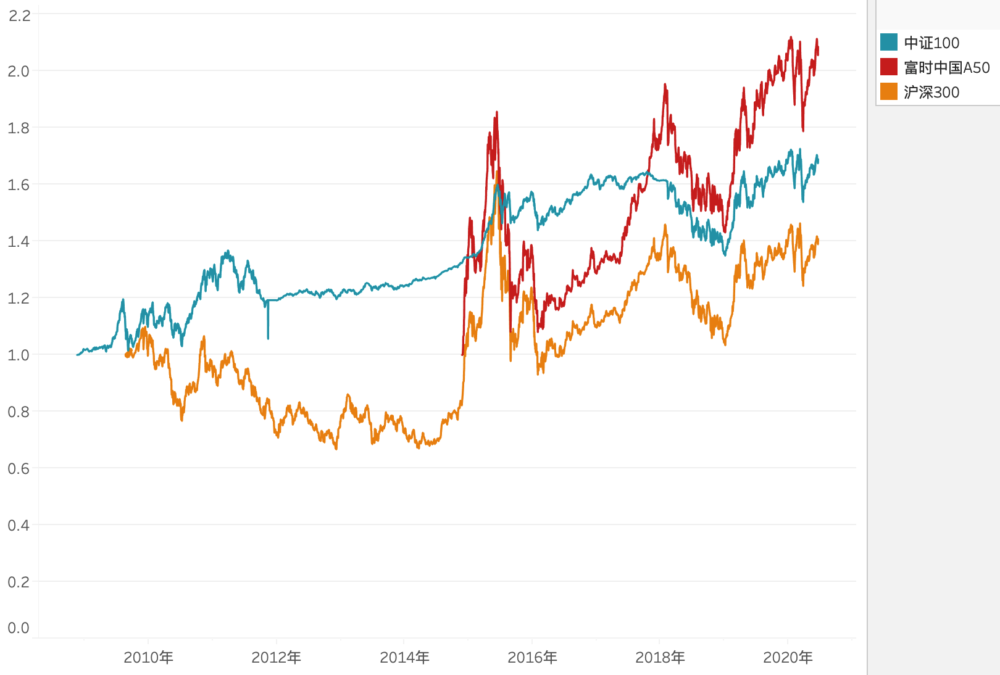

## 宽基指数研究

选取常见的沪深300、中证100、中证500、上证50、上证180、深证100、富时中国A50等指数进行研究。

### 成分构成和编制特点

* 沪深300：选取上海和深圳证券市场中市值大、流动性好的 300 只股票，反映 A 股上市股票价格的整体表现。当样本股分红派息时，不予修正。
* 中证100：选取沪深300 指数成分股中规模最大的 100 只股票，反映 A 股市场最具影响力的一批超大市值公司的股票表现。当样本股分红派息时，不予修正。
* 中证500：从全部 A 股中剔除沪深300 指数成分股以及总市值排名前 300 名的股票后，总市值排名靠前的 500 只股票，反映 A 股市场中一批中小市值公司的股票价格。当样本股分红派息时，不予修正。
* 上证50：选取上海证券市场规模大、流动性好的最具代表性的 50 只股票，反映沪市最具影响力的一批龙头公司股票价格。当样本股分红派息时，不予修正。
* 上证180：类似上证50，选取 180 只蓝筹公司。
* 深证100：选取深圳证券市场质地优良、盈利能力强的 100 只股票（其中中小企业成分股数量不少于 10 只），反映深市多层次市场情况。当样本股分红派息时，不予修正。
* 富时中国A50：选取 A 股市值最大的 50 家公司。当样本股分红派息时，不予修正。

以上指数计算时反映的都是成分股分红后的除权价，而投资应该关注复权价，因此可以考察各指数的衍生指数。包括全收益指数和净收益指数，分别反映样本股税前、税后的红利再投资收益。详细可参考：[http://www.csindex.com.cn/uploads/researches/files/zh_CN/research_c_43.pdf]()。

考虑样本股覆盖沪深两市，侧重关注市值高的企业，重点关注沪深300、中证100、富时中国A50 这三个指数。

### 指数基金历史表现

指数基金更符合指数的全收益指数，因此这里选取历史较长，和指数误差较小的基金数据作为研究对象。

* 沪深300：易方达沪深300ETF联接A（证券代码 110020，跟踪误差：0.08%）
* 中证100：南方中证100指数A（证券代码 202211，跟踪误差：0.14%）
* 富时中国A50：华润元大富时中国A50指数（证券代码 000835）

按各自的历史数据计算其各项业绩指标对比如下，注意，它们的时间周期不一样，并不具备可比性：

| 证券代码 | 年化收益 % | 最大回撤 % | 夏普比率 | 索提诺比率 | Omega比率 |
|--------|-----------|-----------|---------|----------|----------|
| 110020 | 3.23      | -43.61    | 0.11    | 0.16     | 1.02     |
| 202211 | 4.63      | -22.86    | 0.19    | 0.27     | 1.05     |
| 000835 | 14.11     | -41.87    | 0.55    | 0.77     | 1.11     |

下面分别计算近 1 年、近 3 年、近 5 年的业绩指标，可以相互比较：

近 1 年：

| 证券代码 | 年化收益 % | 最大回撤 % | 夏普比率 | 索提诺比率 | Omega比率 |
|--------|-----------|-----------|---------|----------|----------|
| 110020 | 11.19     | -15.17    | 0.51    | 0.69     | 1.10     |
| 202211 | 8.81      | -10.93    | 0.50    | 0.68     | 1.10     |
| 000835 | 15.69     | -15.74    | 0.73    | 1.01     | 1.15     |

近 3 年：

| 证券代码 | 年化收益 % | 最大回撤 % | 夏普比率 | 索提诺比率 | Omega比率 |
|--------|-----------|-----------|---------|----------|----------|
| 110020 | 5.91      | -29.24    | 0.24    | 0.33     | 1.04     |
| 202211 | 1.58      | -18.01    | -0.06   | -0.08    | 0.99     |
| 000835 | 13.30     | -26.84    | 0.59    | 0.84     | 1.11     |

近 5 年：

| 证券代码 | 年化收益 % | 最大回撤 % | 夏普比率 | 索提诺比率 | Omega比率 |
|--------|-----------|-----------|---------|----------|----------|
| 110020 | -0.47     | -38.64    | -0.05   | -0.07    | 0.99     |
| 202211 | 1.64      | -18.01    | -0.08   | -0.11    | 0.98     |
| 000835 | 5.79      | -34.98    | 0.23    | 0.31     | 1.05     |

