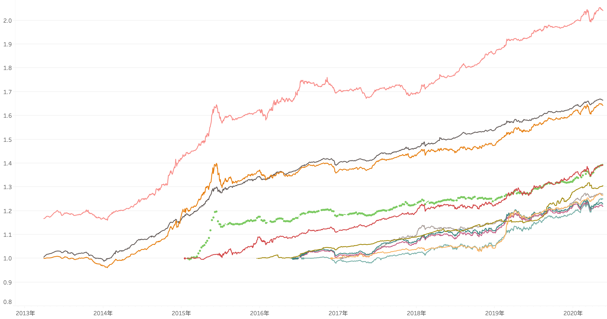
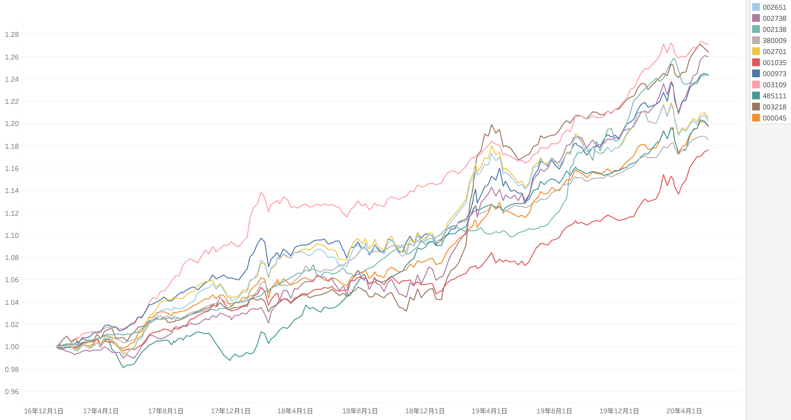
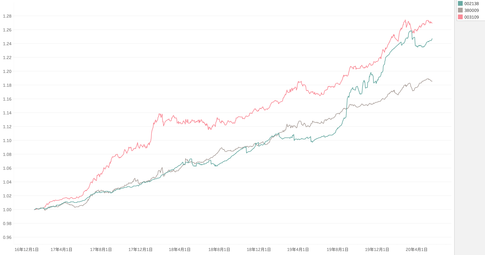

## 债券基金分析


### 国内债券基金种类

1. 纯债：投资纯债券（纯债）
2. 一级债基：债券 + 一级市场股票打新（纯债 + 新股）
3. 二级债基：债券 + 二级市场股票买卖（纯债 + 新股 + 精选个股）
4. 可转债基金：主要投资可转债

因此按风险大小排序 4 > 3 > 2 > 1，相应产品的风险溢价应当与之匹配。某种程度上纯债和一级债基的风险差异不大，一般风险评级也大多是中低风险，二级债基算中风险，可转债基金算中高风险。


### 银行推荐的基金

首先，通过银行理财经理获得了一些二级债基的推荐（其中包含不超过 20% 的股票仓位），我的要求是这几个条件：所有同类债券基金中综合表现靠前、规模别太小、费率低。银行理财经理根据我的要求总结的基金产品需求：

1. 规模大于 5 亿元
2. 现任基金经理管理期限超过 3 年
3. 3 年的累计复权单位净值增长率高于 20%
4. 3 年内的最大回撤小于 -4%

满足以上条件的基金如下：

| 证券代码 | 证券名称                | 3年增长率 | 最大回撤 |
|--------|------------------------|----------|---------|
| 003109 | 光大安和债券A            | 26.627   | -2.0362 |
| 002738 | 泓德裕康债券A            | 25.496   | -3.2432 |
| 003218 | 前海开源祥和债券A         | 24.285   | -2.6910 |
| 002138 | 泓德裕泰债券A            | 23.434   | -2.0392 |
| 485111 | 工银瑞信双利债券A        | 22.885    | -3.2635 |
| 000973 | 新华增盈回报债券         | 22.783   | -3.4512  |
| 000045 | 工银产业债债券A          | 21.254   | -2.7406  |
| 002701 | 东方红汇阳债券A          | 20.587   | -3.6669  |
| 002651 | 东方红汇利债券A          | 20.572   | -3.5991  |
| 380009 | 中银添利债券发起A        | 20.401   | -1.2081  |
| 001035 | 中银恒利半年定开债        | 20.027   | -1.8970 |

以上都是筛选了基金的 A 类产品，另外相应可能还有 C 类产品，比如 003109（光大安和债券A）对应还有 003110（光大安和债券C），两者配置相同，但是费率收取方式不一样。如果有100万资金投资，A 产品会收取每年 0.4% 的运作费用（管理费+托管费）、0.5% 的申购费、持有一个月以上无赎回费；而 C 产品会收取每年 0.7% 的运作费用（管理费+托管费+销售服务费）、无前端费用、持有一个月以上无赎回费。可见，两者相比差异在于 A 有一次性 0.5% 的费用，C有每年 0.3% 的费用，所以如果能够长期持有，那么选择 A 产品费率更低，而短期操作则选择 C 产品费率更低。


### 获取基金历史数据

各基金的历史数据，可以从很多数据来源获取，这里从 eastmoney.com 抓取基金的历史累计净值：

``` python
# Usage: scrapy crawl eastmoney-fund -a code=003109

import scrapy
import execjs
import datetime

from ...utils import io

class EastmoneyFundSpider(scrapy.Spider):
	name = 'eastmoney-fund'

	def start_requests(self):
		yield scrapy.Request('http://fund.eastmoney.com/pingzhongdata/%s.js' % self.code)

	def parse(self, response):
		ctx = execjs.compile(response.text)

		# 累计净值
		ac_worth = ctx.eval('Data_ACWorthTrend')
		rows = []
		for x in ac_worth:
			rows.append([datetime.date.fromtimestamp(x[0]/1000), x[1]])

		io.write_csv('eastmoney-fund-%s.csv' % self.code, ['date', 'worth'], rows)
```

得到列表中所有基金的历史数据如下：




### 选取相同的时间段进行基金业绩比较

为了选取尽可能多的共同数据，以 2017年1月6日作为统一的时间起点，并将净值起点统一换算为 1.0，得到的结果如下：



从图中可以大概看到每个基金的收益斜率以及波动情况，原则上我们需要选择斜率较大，并且波动较小的基金作为投资标的为好。

下面进行定量计算，首先计算日回报率：

``` python
import pandas as pd
df = pd.read_csv('003109.csv')
df['daily_return'] = df['worth'].pct_change()
print(df['daily_return'].mean(), df['daily_return'].std())
```

得到以下数据：

| 证券代码 | 日回报率期望值 | 日回报率标准差 |
|---------|-------------|--------------|
| 003109  | 0.0002968   | 0.0016026    |
| 002738  | 0.0002853   | 0.0024470    |
| 003218  | 0.0002884   | 0.0021367    |
| 002138  | 0.0002709   | 0.0013804    |
| 485111  | 0.0002202   | 0.0015619    |
| 000973  | 0.0002712   | 0.0023029    |
| 000045  | 0.0002207   | 0.0017257    |
| 002701  | 0.0002298   | 0.0022379    |
| 002651  | 0.0002274   | 0.0021681    |
| 380009  | 0.0002087   | 0.0009879    |
| 001035  | 0.0008224   | 0.0032159    |

通过查看数据可以得到，每年的交易日约为 245 天，统计周期为 3.347 年，但有些基金的数据不全，导致交易日天数不一致，因此需要计算不同数据中的每年交易日天数，再换算到年化收益率后再计算夏普比率。如果以三年期定期存款利率作为无风险资产收益率，最近几年无风险收益大约为年化 3%，这里以此为基准计算所有基金的夏普比率：

``` python
import numpy as np
days = df['date'].count()
return_days = days / 3.347
sharpe_ratio = ( return_days * df['daily_return'].mean() - 0.03) / ( df['daily_return'].std() * np.sqrt(return_days) )
print(days, sharpe_ratio)
```

| 证券代码 | 总天数 | 夏普比率 | 
|---------|-------|---------| 
| 003109  | 809   | 1.68    |
| 002738  | 820   | 1.04    |
| 003218  | 820   | 1.22    |
| 002138  | 820   | 1.68    |
| 485111  | 820   | 0.98    |
| 000973  | 820   | 1.01    |
| 000045  | 820   | 0.89    |
| 002701  | 820   | 0.75    |
| 002651  | 820   | 0.76    |
| 380009  | 820   | 1.37    |
| 001035  | 200   | 0.77    |

按夏普比率看，比较突出的基金有：003109、002138、380009，而且从图上可以看到，003109、002138 胜在收益高，380009 胜在波动小。




### 其它业绩指标对比

``` python
import pandas as pd
import empyrical as emp

df = pd.read_csv('002138.csv')
df['daily_return'] = df['worth'].pct_change()

days = df['date'].count()
return_days = days / 3.347
risk_free = 0.03/return_days

annual_return = emp.annual_return(df['daily_return'], annualization=return_days)
max_drawdown = emp.max_drawdown(df['daily_return'])
sharpe_ratio = emp.sharpe_ratio(df['daily_return'], risk_free, annualization=return_days)
sortino_ratio = emp.sortino_ratio(df['daily_return'], risk_free, annualization=return_days)
omega_ratio = emp.omega_ratio(df['daily_return'], risk_free, annualization=return_days)
print(annual_return, max_drawdown, sharpe_ratio, sortino_ratio, omega_ratio)
```

按夏普比率测算相对最好的三个产品，其各项业绩指标对比如下：

| 证券代码 | 年化收益 % | 最大回撤 % | 夏普比率 | 索提诺比率 | Omega比率 |
|--------|-----------|-----------|---------|----------|----------|
| 003109 | 7.39      | -2.02     | 1.68    | 2.57     | 1.34     |
| 002138 | 6.83      | -1.90     | 1.68    | 2.32     | 1.51     |
| 380009 | 5.23      | -1.21     | 1.37    | 2.10     | 1.28     |
