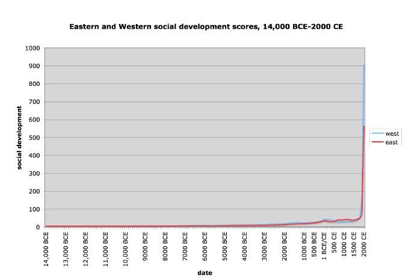
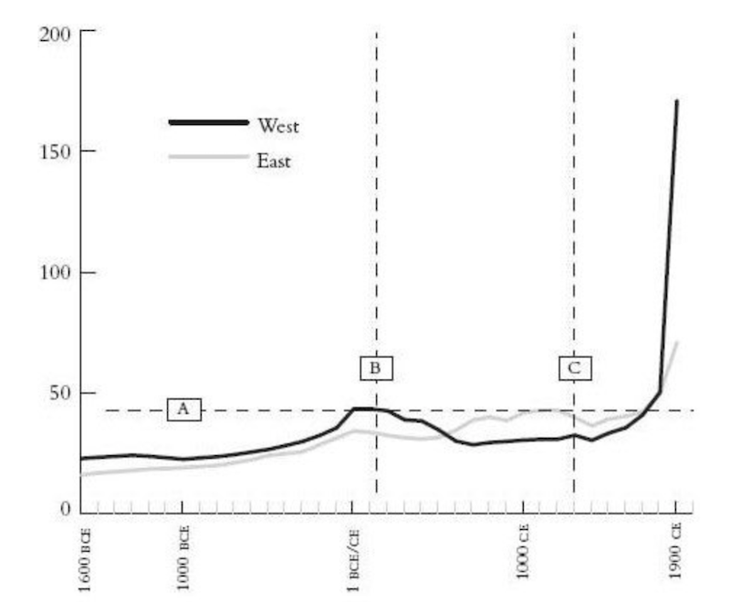

##《文明、现代化、价值投资与中国》（李录）

### 老问题与新史学

新史学，就是利用科学各个领域的前沿发展，跨学科重新构造解读人类长期历史的方法论，相比传统史学的主要突破在于不再局限于文字史，可以研究更久远的历史。

### 文明的轨迹

伊恩·莫里斯提供定量衡量人类长期文明历史轨迹的方法，他称之为社会发展指数，即一个社会能够办成事的能力。社会由人组成，需要消耗能量，而能量守恒，所以衡量一个社会能够办事的能力，最重要的指数就是一个社会摄取和使用能量的能力。

莫里斯把社会摄取和使用能量的能力分成四个方面：

* 摄取能量的能力：社会中每个成员每天能够摄取的食物、燃料、原材料的能力
* 社会组织的能力：社会中最大的永久性居住单位的人口数量，相当于最大城市的人口数
* 信息技术的能力：社会成员交流、存储各种信息的能力
* 战争动员的能力：社会消耗能量的重要来源

也就是说，组织社会、形成人口中心、交流信息、进行战争是所有人类社会都会进行的最重要的活动，通过量化可以进行横向和纵向的比较。

截取公元前1600~公元1900的数据：

### 人类文明的第一次飞跃