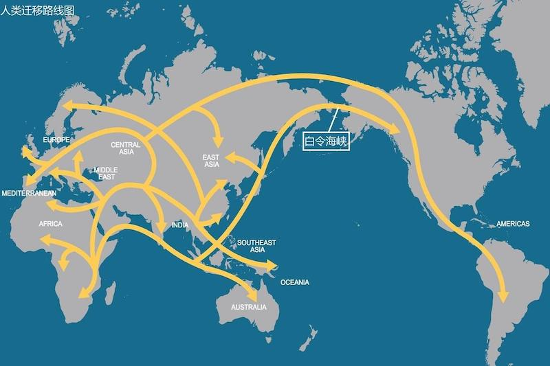

## 《文明、现代化、价值投资与中国》（李录）

### 老问题与新史学

新史学，就是利用科学各个领域的前沿发展，跨学科重新构造解读人类长期历史的方法论，相比传统史学的主要突破在于不再局限于文字史，可以研究更久远的历史。

### 文明的轨迹

伊恩·莫里斯提供定量衡量人类长期文明历史轨迹的方法，他称之为社会发展指数，即一个社会能够办成事的能力。社会由人组成，需要消耗能量，而能量守恒，所以衡量一个社会能够办事的能力，最重要的指数就是一个社会摄取和使用能量的能力。

莫里斯把社会摄取和使用能量的能力分成四个方面：

* 摄取能量的能力：社会中每个成员每天能够摄取的食物、燃料、原材料的能力
* 社会组织的能力：社会中最大的永久性居住单位的人口数量，相当于最大城市的人口数
* 信息技术的能力：社会成员交流、存储各种信息的能力
* 战争动员的能力：社会消耗能量的重要来源

也就是说，组织社会、形成人口中心、交流信息、进行战争是所有人类社会都会进行的最重要的活动，通过量化可以进行横向和纵向的比较。

截取公元前1600~公元1900的数据：

### 人类文明的第一次飞跃

作者把人类文明发展阶段分成三部分：

* 1.0：采集狩猎文明
* 2.0：农业畜牧业文明
* 3.0：科技文明

人类文明发展过程中气候是一个最大的影响因素，米兰科维奇循环理论指出地球公转轨道偏心率、黄赤交角、岁差三大因素影响了北半球高纬夏季太阳辐射量，从而造成地球气候的大循环，循环周期大约 10 万年。

> 米兰科维奇理论指出气候变化存在三个周期：每隔 2.6 万年岁差变化周期；每隔 4.1 万年黄赤交角变化周期；每隔 10 万年公转轨道偏心率变化周期。理论上讲偏心率变化相比于岁差和黄赤交角对气候的影响应该更小，但是从同位素分析历史气候得到的结果是气候变化周期大约为 10 万年，这被称为十万年问题。

离现在最近的两次冰川纪最严重的时候是 19 万年前和 9 万年前，现代人类的祖先智人在 15 万年前出现，这时恶劣的气候让人类只能生活在非洲靠近赤道很有限的区域。到了 7 万年前，气候开始好转，地球其它区域开始变得温暖湿润，给人类提供了更好的狩猎、采集的条件。

这是人类文明的第一次飞跃，这个过程显示出人类和其它动物甚至其它类人猿的不同，人类在几万年的时间内，从非洲迁移到全球几乎所有角落。这让人类人口迅速增长，而且基因多样性和适应性大大增加，这意味着当气候再次变化时也有更多的机会生存，濒临灭种的可能性大大降低，人类已经为下次飞跃奠定了坚实的基础。

### 农业文明的诞生

