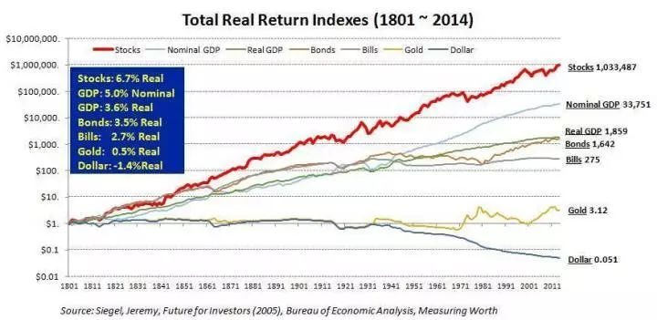
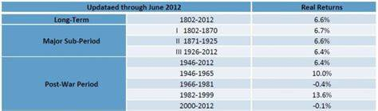

## 《文明、现代化、价值投资与中国》（李录）

### 老问题与新史学

新史学，就是利用科学各个领域的前沿发展，跨学科重新构造解读人类长期历史的方法论，相比传统史学的主要突破在于不再局限于文字史，可以研究更久远的历史。

### 文明的轨迹

伊恩·莫里斯提供定量衡量人类长期文明历史轨迹的方法，他称之为社会发展指数，即一个社会能够办成事的能力。社会由人组成，需要消耗能量，而能量守恒，所以衡量一个社会能够办事的能力，最重要的指数就是一个社会摄取和使用能量的能力。

莫里斯把社会摄取和使用能量的能力分成四个方面：

* 摄取能量的能力：社会中每个成员每天能够摄取的食物、燃料、原材料的能力
* 社会组织的能力：社会中最大的永久性居住单位的人口数量，相当于最大城市的人口数
* 信息技术的能力：社会成员交流、存储各种信息的能力
* 战争动员的能力：社会消耗能量的重要来源

也就是说，组织社会、形成人口中心、交流信息、进行战争是所有人类社会都会进行的最重要的活动，通过量化可以进行横向和纵向的比较。

截取公元前1600~公元1900的数据：

### 人类文明的第一次飞跃

作者把人类文明发展阶段分成三部分：

* 1.0 文明：采集狩猎文明
* 2.0 文明：农业畜牧业文明
* 3.0 文明：科技文明

人类文明发展过程中气候是一个最大的影响因素，米兰科维奇循环理论指出地球公转轨道偏心率、黄赤交角、岁差三大因素影响了北半球高纬夏季太阳辐射量，从而造成地球气候的大循环，循环周期大约 10 万年。

> 米兰科维奇理论指出气候变化存在三个周期：每隔 2.6 万年岁差变化周期；每隔 4.1 万年黄赤交角变化周期；每隔 10 万年公转轨道偏心率变化周期。理论上讲偏心率变化相比于岁差和黄赤交角对气候的影响应该更小，但是从同位素分析历史气候得到的结果是气候变化周期大约为 10 万年，这被称为十万年问题。

离现在最近的两次冰川纪最严重的时候是 19 万年前和 9 万年前，现代人类的祖先智人在 15 万年前出现，这时恶劣的气候让人类只能生活在非洲靠近赤道很有限的区域。到了 7 万年前，气候开始好转，地球其它区域开始变得温暖湿润，给人类提供了更好的狩猎、采集的条件。

1.0 文明是人类文明的第一次飞跃，这个过程显示出人类和其它动物甚至其它类人猿的不同，人类在几万年的时间内，从非洲迁移到全球几乎所有角落。这让人类人口迅速增长，而且基因多样性和适应性大大增加，这意味着当气候再次变化时也有更多的机会生存，濒临灭种的可能性大大降低，人类已经为下次飞跃奠定了坚实的基础。

### 农业文明的诞生

最后一季冰川纪的结束于 2 万年前，1.27 万年前地球气温回升到和当下相差几度的温度，特别适合动植物生存。从这以后，欧亚大陆的东西两边开始出现各种野生谷物，大约每花费 1 卡能量采集，就可以在食用时获得 50 卡能量。因此人类群落规模开始变大，逐渐形成文明中心。

2.0 文明的飞跃源于人类在这个时期开始种植植物和圈养动物，掌握了品种杂交、施肥除草、配种、喂养等技术。但是由于地理环境和自然资源的不同，农业和畜牧业的出现在全球范围很不均衡，有些 1.0 文明时代最适宜的地区，到了 2.0 文明时代并没有优势。从农业资源分布看，中东的侧翼丘陵区和中国黄河长江流域是最幸运的区域，因此公元前 9600 年左右在侧翼丘陵区出现农业，公元前 7000 年左右在中国出现农业。随后，先进的农业文明传播开来，公元前 4000 年左右覆盖到西欧，公元前 1500 年左右覆盖到朝鲜、日本。到了公元前 1500 年，基本上整个亚洲、中东、北部非洲、欧洲都已进入 2.0 文明时代。

> 侧翼丘陵是环绕新月沃地周围的一圈山腰地带，从农业出现的角度看，不同的麦类在不同的山脉得以驯化，最早农业并不是出现在平地，而是在山前地带。

在第二次文明飞跃的过程中，能否和先进文明交流决定了不同地区的发展差异，今天世界上最发达的文明，都是从最幸运的两个中心发展而来，分别形成东、西方的概念。

### 农业文明的天花板及三次冲顶

农业文明时代始终在上升-冲顶-衰落的循环中重复，根本在于农业生产依赖光合作用，其产出存在天花板。

历史上三次冲顶，第一次在西方是罗马帝国、东方是秦汉；第二次在东方是唐宋、西方则经历更加漫长的衰落期，但在蒙古大征服在西欧停止后，给西欧留存了下一次文明爆发的绝好条件，1500 年左右西欧开始下一次上升。

最后一次冲顶，在 17、18 世纪，无论东方、西方都再次冲向农业文明的极限，但这次东西方在这个过程中遇到的挑战和获得的机遇截然不同，导致了接下来几百年截然不同的命运。

### 农业文明中的思想革命和制度创新

农业文明的铁律是社会发展存在瓶颈，每次冲顶后的衰落和毁灭期都是对世人的磨砺，这通常成为思想革命的源泉。

第一次思想革命以东方的孔子、中东的耶稣、印度的释迦牟尼、希腊的苏格拉底柏拉图亚里士多德等为代表；第二次思想革命在中国以佛教传播、西方的基督教、中东的伊斯兰教等宗教传播为代表。

> 这里的逻辑说服力并不强，比如百家争鸣时代和第一次农业文明冲顶失败的时间先后并不符合假设。

而农业文明思想的最重要遗产是高端政府政治制度的建设，最伟大的制度创新是科举制。科举制以人的学习能力、知识水平、行政能力作为考核的根本，用公平、透明、公开的方式提供所有人机会，不受出身和血缘的限制，保障选出的人才既有能力、又能效忠政权。这个制度创新是助跑中国领先西方约 1200 年的重要原因。

### 美洲大陆的发现及其划时代影响

人类在公元前 15000 年通过西伯利亚大陆桥进入美洲，但公元前 12000 年冰川纪结束海平面升起断绝了这个大陆桥，此后一万多年美洲与世界是隔离的，而且美洲本身没有适合农业、畜牧业的野生植物和动物，导致社会发展程度很低。

欧洲人希望能打开与印度和中国的贸易通道，通过航海偶然发现了美洲大陆，并通过枪炮和病菌基本消灭了美洲大陆的原住民，相当于在 16 世纪初直接继承了一个崭新的大陆（西欧面积的近 9 倍），形成一个新的庞大的环大西洋经济圈。

美洲大陆和环大西洋经济圈的形成给欧洲的知识分子提出了一系列新的问题，包括地理学、地质学、生物学、航海技术、天文学等等，这促进了欧洲启蒙运动的发展，促使人们以观察、实验为基础形成全新的世界观，并对经济、政治、文化、宗教、社会等人类文明领域使用同样理性、科学的方法进行批判性思考。

### 现代化的诞生

亚当·斯密的《国富论》以及后继者李嘉图的社会分工分析，表明了自由贸易的优势，从理论上解释了为什么贸易会带来繁荣和财富，并且市场越大、贸易带来的财富增量也越大。英美两国开始在全球推动自由贸易、自由市场，这为 3.0 文明在世界的传播和发展带来深远影响。

蒸汽机的发明给人类历史带来的变化更大，它让人可以掌控的动能从原来肌肉的几倍迅速变为几百、几千、甚至几近无穷倍。蒸汽机带来的能源-动力转换的能力让人对机械的掌握到达一个空前的水平，从此科学和技术形成良性循环，互相影响，互相推动，促进了人类对自然的掌握。

现代科技和现代自由市场经济的结合形成了人类历史上最伟大的制度创新，这让所有人都有可能实现自己的才华，得到自己应得的物质财富。

### 现代化有没有可能在中国诞生

不可能，作者认为 3.0 文明诞生的根本原因是大西洋经济的形成，其最大特点就是自由市场经济，中国王权政权在全世界最发达最稳固，因为不能产生这样的制度。

> 自由市场经济引发对科学的需求，产生的工业革命从而走向现代科技，这个逻辑在这个叙述中并不严密。

### 现代化的传播与现代化的道路之争

纵观 19 世纪世界历史，始终有一条脉络贯穿所有国家：不是主动进入现代化，就是被动卷入现代化。中国从 1861 年到 1945 年，先后被慈禧的庸政、外患、日本侵略耽误了一个世纪，直到 1949 年。

20 世纪则是现代化道路之争的世纪，德国、日本的国家资本主义和苏联的计划经济，都试图开辟出自由市场经济之外的另一条道路，直到二战及其后的冷战结束，英美经济模式取得胜利。中国到 70 年代末开始，才进入到市场经济和科技发展并行的时代，此后 40 年 GDP 增长 100 多倍。

### 现代化的本质和铁律

现代化就是当现代科技与市场经济结合时所产生的经济无限累进增长地现象。在相互竞争的不同市场之间，最大的市场最终会成为唯一的市场。今天，这个最大市场叫全球化。

市场交换引起的规模效应在 2.0 文明时代同样存在，但是因为没有现代科技，产品有限，经济存在天花板，无法形成 3.0 文明时代不断进步的科技和市场结合不断累进增长地状态。

### 对中国未来几十年的预测 —— 经济

后发国家在追赶的早期，因为发展目标明确（基础设施、传统制造业），所以政府主导、市场跟进可以有效地加快追赶速度。

中国未来最核心的变化是从政府主导的市场经济转变为政府辅助的全面自由市场经济，政府专注成为游戏规则制定者和裁判员，如此中国则仍有可能以高于全球经济发展速度的水平保持增长，直至大体赶上发达国家水平。

### 对中国未来几十年的预测 —— 文化

* 以理性思维和科学方法重整传统文化
* 应对科技文明对文化观念的挑战与要求
* 深植于传统中的文化传承和现代化演进

### 对中国未来几十年的预测 —— 社会政治

* 科技文明时代对现代政治的要求
* 西方的实践 —— 宪政民主
* 中国传统政治思想、政治实践及其演化
* 东西方各自独特的道路

### 从文明史角度看当今中美关系及科技文明时代的东西方关系

3.0 文明时代最核心的诉求就是市场的大小，二战胜利后，美国通过一系列世界性组织牢牢把握全球市场的规则制定权、市场准入权、制裁清除权。

作者认为美国秩序对其它国家的政治从来没有统一的硬性约束，在不挑战且尊重现有国际市场准则的前提下，中国需避免正面挑战美国，尊重美国作为 3.0 文明时代国际秩序主导者，遵守目前的国际规则。市场上要更开放、国际关系上承担更多义务。

> 这部分论述诉诸逻辑的部分不强，对国家利益冲突等方面均无涉及。

当今 3.0 文明时代的国际间关系，受到一些根本的刚性限制：

* 全球唯一的大市场
* 核武器大国都具备将全球毁灭很多次的能力
* 一些特殊挑战只能依靠国际间合作（环境、反恐、能源）

中国最重要的对策是坚持改革开放，坚持市场经济，坚持不离开国际共同市场。东西方之间的不同、冲突、误解可能是局部的、短暂的、可控的；而未来信任、合作、共同利益和发展将会成为主流。

### 人类未来的共同命运

3.0 文明建立在石化燃料的利用上，石化资源最早也是通过光合作用形成的，它通过几百万、甚至上亿年的累计浓缩而成，因而拥有强大的能量密度，这是地球积攒了几亿年的宝贵遗产，但是这遗产始终是有限的。那么未来能源是什么？以石化资源为基础的化肥如何替代？这是人类共同面临的巨大挑战。

> 核能为何没有纳入未来考量的预测中？

地球承载力是另外一个大的挑战，未来人的寿命或许可以无限增加，到时候人就要像当年走出非洲一样，在其它星球寻求新的生存空间。

### 价值投资在中国的展望

资产管理行业里的用户在绝大多数时间里，不知道、无法判断产品的好坏，也无法判断得到的服务是优秀的还是劣质的。而且，即使从业人员自己也很难判断准确。同时，这个行业总体来说报酬高于其它几乎所有行业，也常常脱离对客户财富增长的贡献。这两个特点加起来造成这个行业一些很明显的弊病，希望行业从业者有两个道德底线：

1. 追求真知、智慧，要有意识地杜绝一切屁股决定脑袋的理论
2. 真正建立起受托人责任的意识，把客户的每一分钱看成是自己父母节俭一生省下来让你打理的钱

长期看，哪些金融资产真正能够为客户提供长期可靠的财富？股票 > 长期债券 > 短期债券 > 黄金 > 现金

扣除大约年化 1.4% 的通胀后，实际 GDP 的年化增长大概 3.6%，股票的年化增长大概 6.7%。因为股票代表了市场里一定规模以上的公司，GDP 的增长很大意义上由这些公司销售额的增长决定的。一般来说公司会有一定成本，但是成本相对固定，不会像销售额增长那么大，所以净利润的增长一般会比销售额的增长更快，当销售额以 4%、5% 的速度增长（反映到GDP），净利润就会以大概 6%、7% 的速度增长（反映到股票），股票的核心是利润本身的增长反映到今天的价值，过去 200 年美国股票的平均市盈率在 15 倍左右，那么倒过来每股现金的收益就是 1/15，大概 6.7% 左右。

GDP 能否持续稳定地增长？3.0 文明的特点：整个经济出现持续的、累进的、长期复利性的增长。这是财富增长的根源。

但是如果把时间拉短，不同时间段的股票表现波动非常大：

所以，投资股票指数是不可行的，人的投资时间是有限的，绝大多数投资人的时间是十几年、二十几年，如果正好位于一个不好的时间段，很难保证投资的收益。真正能够在长时间里可靠地带来长期优秀回报的只有价值投资。

价值投资的理念只有四个：

1. 股票不仅是可以买卖的证券，实际代表的是对公司的部分所有权
2. 在价值投资者看来，市场的存在只是为你服务的，市场从来不能告诉你，真正的价值是多少，它只能告诉你价格是多少。所以，不能把市场当做老师
3. 投资的本质是对未来的预测，预测就不能百分百准确，所以做判断时必须预留很大的空间，叫安全边际。买入的价格一定要大大低于公司的内在价值。
4. 投资人可以通过长期不懈的努力，真正建立起自己的能力圈，能够对某些公司、某些行业获得比几乎所有人更深的理解。在这个能力圈里就是自己的独特能力。投资真正的风险不是股票价格的上上下下，而是资本永久性地丢失。这个风险是否存在，取决于投资者有没有这个能力圈，而且这个能力圈一定要非常狭小，有明确的边界。只有在狭小的、有明确边界的能力圈里，才有可能通过持续长期的努力建立起真正对未来的预测。

在中国价值投资是否适用？从根本上中国近年的飞速发展的原因是顺应了 3.0 文明的铁律：坚持自由的市场经济和现代科技技术。如果中国人、中国文化在经历了几千年的成功之后不愿意称为失败者，那么任何短暂地偏离 3.0 文明主轨的行为，应该会很快被修正。这样，经济仍然会持续累进地增长，各种金融资产的表现也会遵循历史上成熟市场经济国家的基本模式，这是价值投资在中国可以实行的最根本原因。

而且，目前中国不成熟的金融市场中， 70% 仍然是散户，以短期交易为主，包括很多机构也是如此，价格常常会大规模背离其内在价值，产生独特的投资机会。而中国目前正在进行的经济转型，也在实际上要求金融市场扮演越来越重要的融资角色，让股票市场、债券市场成为资源配置的主要工具，真正的价值投资人会发挥越来越重要的作用。

