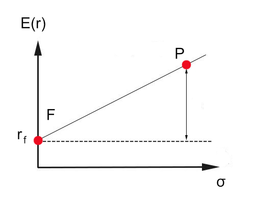
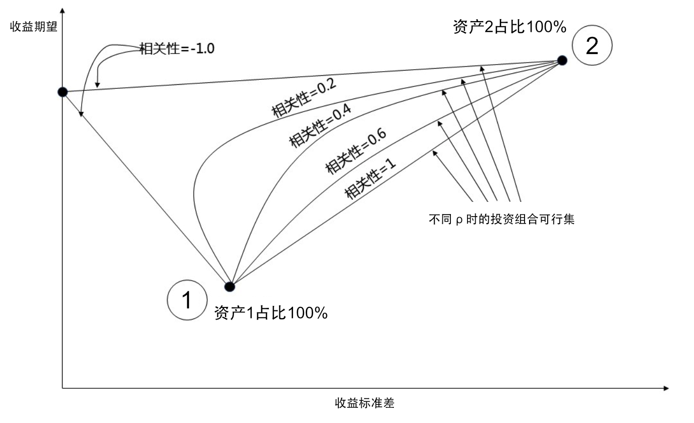
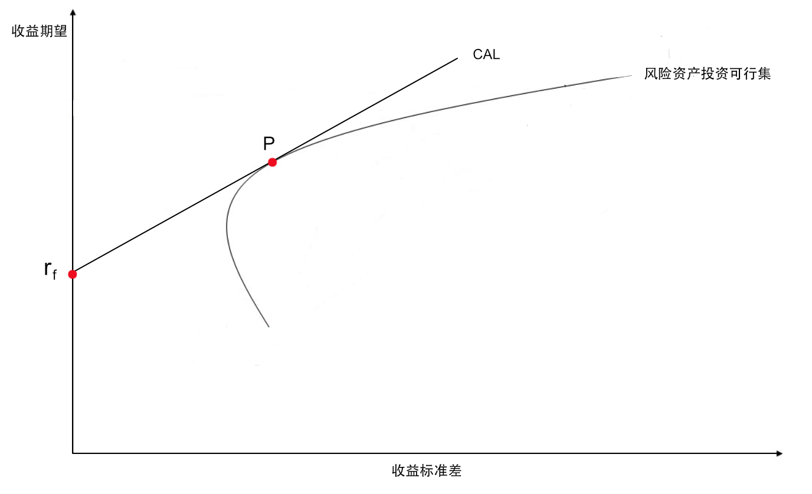
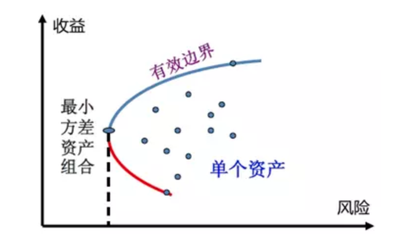
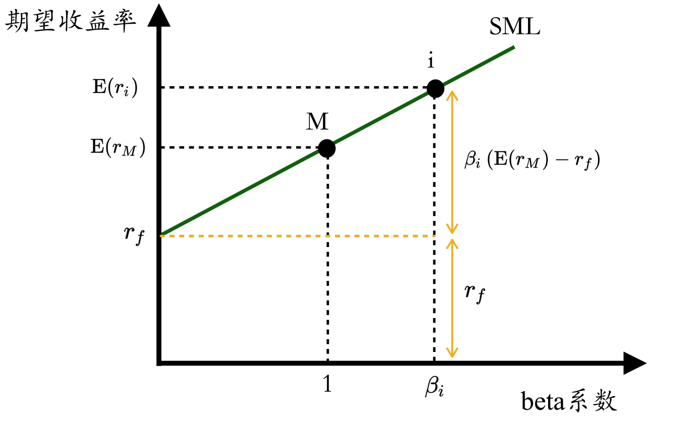

## 《投资学》（博迪 精简版）

### 第1、2章 投资学基本概念

首先是关于资产的定义。社会的物质财富取决于社会的产生能力，生产能力取决于社会的**实物资产**（Real Assets，如有形的建筑、设备、土地/无形的知识产权等）；与之相对应的就是**金融资产**（Financial Assets，如股票、债券等），它不能增加社会的生产能力，它只代表了对实物资产所产生的物质财富的索取权。

投资者拥有了一定的金融资产，就意味着金融资产的发行者拥有了一定的负债。真正的社会财富取决于实物资产，实物资产的表现决定了金融资产的价值。

投资者通常会同时投资实物资产和金融资产，比如既购买不动产，又持有股票和基金。

---

金融资产通常有三类：

1. **固定收益型**：即债务型证券，承诺支付一定的利息，比如国库券、银行存单、债券等。同是债务型证券，风险也是有高有低，比如国债风险就很低，而一些公司发行的债券风险相对就高。

2. **权益型**：代表对标的的所有权份额，比如公司的股票，它的收益和公司的经营状况相关。

3. **衍生品**：取决于其它资产的价格，比如期权、期货，主要作为风险管理工具来转移风险。

> 这些金融资产虽然不能直接创造财富，但是金融资产以及金融资产交易形成的金融市场，对繁荣社会财富有重要作用。这些作用包括：
> 
> * 资本优化配置，引导资金流向前景好的行业和公司
> * 储存财富，延迟消费
> * 引导不同风险偏好的投资者承担不同程度的风险（当然，收益也不同）
> * 公司所有权和经营权分离
> * 一些金融市场的制度安排可以提升公司治理（比如上市公司必须有一定的透明度，以免误导投资者）

金融资产的投资过程，就是构建符合自己需求的投资组合。这里主要需要投资者做出两步决策：第一步：**资产配置**（决定各种不同风险和收益的资产大类的比例，比如：一半投资低风险的货币基金、一半投资股票），第二步：**证券选择**（决定具体买哪几个货币基金、哪几支股票）。

---

金融资产的交易构成了金融市场。在金融市场中，个人的资产规模过小，直接进行投资通常比较困难，因此发展出各种**金融中介**。比如银行，吸收储户的存款然后放贷给公司（也就是投资给公司）；共同基金也类似，吸收个人投资者的资金进行各种投资。另外还有投资公司、保险公司等，这些都是主要从小投资者入手提供服务的中介。

投资银行则是服务于企业，帮助公司专门从事向公众发行证券的工作。投资银行负责在一级市场销售公司证券（此时投资银行就是公司的承销商），随后投资者可以在二级市场买卖一级市场发行的证券。
> * 一级市场：新证券发行的市场（发行市场）
> * 二级市场：已发行的证券流通的市场（流通市场）

某种程度上，金融资产对应了金融市场工具。比如股票是一种金融市场工具，投资人持有的股票就是相应的金融资产，但是对于股票发行的公司来说，这是一笔金融负债。
 
---

下面概述各种类型的金融市场（也就是可投资的金融资产的类型）：

1. 货币市场（Money Market，固定收益型）

	货币市场上的主要资产类型有国库券、定期存单、商业票据（短期无担保债务票据）、银行承兑汇票、回购协议等，货币市场总体来说风险很低。这些资产很多个人投资人是无法投资的，所以货币市场基金（Money Market Funds）成为对货币市场进行投资的主要途径，个人投资者可以通过购买货币市场基金份额来实现对货币资产的投资。
	
	货币市场基金的主要风险来源于系统性风险，2008 年雷曼兄弟倒闭导致其发行的商业票据无法兑现，货币基金 Reserve Primary Fund 的资产中配置了不到 1.5% 的雷曼兄弟商业票据，但投资人恐慌性地赎回导致基金规模锐减到三分之一，流动性枯竭，每份产品净值跌破 1 美元到 0.97 美元，这是历史上第一次。同时，其它主要的货币基金也遭到严重挤兑，为了避免进一步资金流出，美国财政部宣布将为货币基金提供联邦保险，相当于给货币基金提供类似银行的保险业务。
	
2. 债券市场（Bond Market，固定收益型）

	债券市场上的主要资产类型有中长期国债、国际债券、市政债券（地方政府债券）、公司债券、抵押贷款和抵押担保证券等，债券的风险主要来源于债券发行主体的违约风险。同样，债券市场基金（Bond Market Funds）是个人对债券市场进行投资的主要途径。
	
3. 股票市场（Stock Market，权益型）
	
	股票对应了某个公司的一部分所有权，其风险主要来源于公司的经营状况。投资股票的收益来源于两个方面，一方面是股利（股息、红利，优先股和普通股的派息、分红有不一样的设置），分配公司的经营利润；另一方面是资本利得（股价上涨带来的资本收益）。
	
	股票的市盈率（市价盈利比例，Price-Earnings Ratio，P/E）指当前股价与上一年每股收益的比值。一般市盈率越低，表明投资回收期越短，投资风险就越小，股票的投资价值就越大。
	
	最近20年的普标500市盈率变化：
	
	
	最近20年的A股市盈率变化：
	
	
4. 衍生工具市场（Derivatives Market，衍生品）

	期权、期货等金融工具也被称为衍生资产，其收益依赖于其它资产的价值，比如商品价格、股票价格、债券价格等。
	
---

市场指数（Index，或许叫指标可能更不容易引起歧义）是用一个计算数值来衡量某个市场的表现。最常见的是各种股票市场指数，如标普500（S&P 500）指数、威尔逊5000（Wilshire 5000）指数、上证综合指数、富时中国A50指数等等。

某一种股票市场指数，就是通过挑选一定的成分股，来反映市场的变化情况。不同的成分股挑选、以及不同的加权方式，代表了对市场某个方面的关切。

投资者完全可以复制某个指数的定义，来构建自己的投资组合，指数基金（Index Funds）就是这样做的。这是一种低成本的消极型投资策略，但很有效，比如标普500近 50 年的平均年收益率在 10% 左右，因为标普500的成分股涵盖了美国 500 多家顶级上市公司，约占美国股市总价值的80%，按标普500的定义来构建投资组合是一种很稳健的价值投资策略。

### 第3章 风险和收益

投资除了关注期望收益，关注风险同样重要。但因为风险的不确定性，以及风险很难直接观测，所以我们只能通过历史分析来推断过去的风险（这点常会被忽视，比如虽然很容易看一个投资产品的过往业绩，但是你无法直接观测某个时点其所持资产面临的风险）。

而且，即使分析了历史风险，也不代表未来也是如此，即使选取再长的历史时期进行分析，也无法保证历史中涵盖了未来可能发生的最好或最坏的情况，这就是**黑天鹅**问题。

以此看来，投资者需要对风险有足够的敬畏。

---

在投资决策中，利率水平是非常重要的一环。如果预计未来利率上升，那么投资者会更倾向于短期投资；反之如果预计未来利率会下降，那么投资者会倾向长期的固定利率储蓄。

研究利率首先要区分**名义利率**（R）和**实际利率**（r）。

以一年期的利率为例，如果名义利率 R 为 10%，也就是年初投资 100 块，年终得到 110 块，但是这一年过去后货币的购买力可能下降了，这个以通货膨胀率衡量，比如为 6%，也就是说 100 块能买到的东西，必须要 106 块才能买到，那么实际利率 r 是 (110 - 106)/106，比近似值 4% （10%-6%） 还要略低。

实际利率 r 理论上决定于资金的供需关系，如果实际利率提高，那么资金需求会减少（企业借贷的成本增加），资金供给会增加（居民会更倾向于推迟现时消费而进行储蓄）；反之也相反，这是一个动态平衡的过程。政府可以通过货币手段（如多发行货币，即增加通货膨胀率）或者财政手段（如增加预算赤字，即政府向市场借款导致未来利率期望的增加）来调整实际利率，从而调节资金供给和需求。

---

资产在不同持有期的收益率肯定是不同的，所以需要换算成某一常用期限的收益率，比如一年。

* 有效年利率（Effective Annual Rate，EAR）：一年期投资价值增长百分比（采用复利）
* 年化百分比利率（Annual Percentage Rate，APR）：将收益率按投资时长伸缩到一年期（不采用复利）

把投资时长记为 T，一年中有 n = 1/T 个复利周期 ，那么：$1 + EAR = ( 1 + APR / n ) ^ n$

假设年化利率 APR = 4%  
如果 T = 1， EAR = 4%  
如果 T = 1/12， EAR = 4.07%
如果 T = 1/365，EAR =  4.08%

显然，如果不同产品的 APR 相等，那么投资时长 T 越短越好。另外，当给定 EAR 但是投资时长 T 趋近于零时，这时候的 APR 的极限称为连续复利（Continuous Compounding），Rcc = ln( 1 + EAR )。

---

考虑一个 n 年的投资行为，如果不考虑复利的存在，那么收益率就是简单的算术平均值（ (A1+...+An)/n ）；但是如果考虑复利，那么收益率就应该从几何平均值（$ (A1*...*An)^{1/n}$ ）进行推算。

比如投资了 100 块，经过5年投资期后的收益为 10 块，那么按算术平均值来算，年收益率应该是 2%；但是按几何平均值来计算，年收益率为 1.92%（$1.1^{0.2}-1$）。在收益率波动较大，特别是出现了负收益率的时候，两者的差异可能会比较大。比如第一年收益率为 -22%，第二年收益率为 28%，如果不考虑复利则年收益率为 3%；但如果考虑复利，那么收益率就几乎为 0% 了，显然，第一年赔钱后，后一年需要更高的收益率才能填平前一年的损失，因为本金变小了。

---

考虑投资一个指数基金，一年后每份基金的价格显然具有很大的不确定性，但是我们可以从历史数据中来评估一年后这个基金可能的状态，这个状态显然取决于历史数据的概率分布，从数据中可以得出收益的**期望值 E** 和**标准差 σ**，E 代表了收益的高低，σ 代表了收益的波动，也就是某种程度风险的度量。（但很显然，这不能完全代表风险，特别是未来的风险）

我们投资一个高风险的资产，肯定是希望得到更高的收益。那么，资产的收益率和无风险资产的收益率（比如银行存款利率）的差值，就是风险的溢价，称之为**超额收益**。这个超额收益的分布同样有期望值和标准差，这样我们就可以从概率分布上去定量地描述风险的溢价。

总结一下，评估收益和风险，可以把投资的收益率分解成无风险收益率和超额收益两部分，然后用概率分布来进行定量描述。

**夏普比率**（Sharpe Ratio）用来综合评估收益和风险，夏普比率 = 超额收益的期望值 / 超额收益的标准差。这个比率被广泛应用于评估投资经理的业绩，显然这个比率越高越好。

---

在关于超额收益的概率分布上，先假设其符合正态分布，后续也考虑了偏度分布、肥尾分布等。然后，用**在险价值**（Value at Risk，VaR）来度量一定概率下发生极端负收益造成的损失（就是分位数，比如 5% 的 VaR 就代表 95% 的收益率都大于该值）。

> 对超额收益的概率分布进行假设似乎并无必要，虽然从书中所举的历史数据似乎和正态分布拟合得不错，基金则采用肥尾分布假设，但是作者也提醒由于数据样本的稀缺导致概率分布模型存在潜在的风险。既然用 VaR 来衡量风险，那么超额收益的概率分布并不一定需要进行假设。由切比雪夫不等式我们就可以知道，对于任意的概率分布，位于期望值附近 k 个标准差范围内的概率总是大于 $1 - 1/k^2$。那么，5% 的 VaR 一定是位于 4.47 个标准差 σ 范围内的（而且计算还有富余，因为负收益只在期望值的左侧）。

### 第4章 风险厌恶和风险资产配置

显然，风险资产都需要风险溢价作为补偿，高风险必须以高收益为回报。那么，综合风险溢价和风险来考虑，可以给每一种资产评估一个效用值，比如应用最多的一个效用值函数是这样的：

$U = E - 0.5 * A * σ^2$

其中，E 是超额收益的期望值，A 是投资者的风险厌恶系数，σ 是超额收益的标准差。如果 A < 0 代表投资者是风险偏好型，一般投资者的 A > 0。

所以，在 E 和 σ 确定的基础上，一个资产的评估取决于投资人的风险厌恶系数 A 的评估。显然，如今去银行购买理财之前首先要求客户做的风险评估就是类似的方法。

---

现实中，大多数投资人将货币市场工具视为**无风险资产**，因为其风险和长期债券、股票或者房地产相比微乎其微。

当一个风险资产 P 和一个无风险资产 F 放到一个资产组合中，那么资产组合的超额收益标准差就是风险资产的超额收益标准差再乘以它在组合中的比例 y。如果以这个变化的标准差为横轴，资产收益率为纵轴，那么所有可能的资产组合构成了一条截距为无风险资产收益率，斜率为风险资产夏普比率的直线（资本配置线，Capital Allocation Line，CAL），如下图：

y 可以大于 1 ，这就是通过负债给投资加杠杆的情形。

---

投资者通过调整资产组合中风险资产的比例，来达到整体效用值 U 最大化的目的。

也就是要求 $E_F +  y * ( E_P - E_F) - 0.5 * A * ( y * σ )^2$ 最大化，此时该函数的导数为 0，也就是 $E_P - E_F - A *  σ^2 * y  = 0$：

$y = ( E_P - E_F ) / ( A  * σ^2 )$

> 效用值 U 定义中的 0.5 * A 最终决定了 y 的取值，但是这个值很难准确评估。

---

评估 A 的一种方法是通过市场指数来进行。比如我们假设被动投资策略包含了无风险的货币基金和有风险的、模拟标普500指数的基金，这样的投资组合的资本配置线（CAL）称为资本市场线（Capital Market Line， CML），从历史数据中得到的大概 85% 的家庭财富会投资到风险资产上，也就是 y = 0.85，标普500指数的平均风险溢价为 7.9%，标准差为 20.8%，那么带入上面的公式可以得到 $A = (0.079) / ( 0.85 * 0.208^2) = 2.15$。

所以，从市场数据看，采用 $U = E - 0.5 * A * σ^2$ 这个定义的话，一般投资者的 A 在 2 ~ 4 之间。

### 第5章 最优风险资产组合

前面第4章的讨论主要围绕配置一个无风险资产和一个风险资产的问题展开的，那么，如果配置两个风险资产时会发生什么？这就是金融资产分散化配置的问题。

如果投资组合中的金融资产没什么相关性，那么加入多个资产会使收益方差产生相互抵消的效果，也就是在保证收益期望的前提下，降低了风险。当然，有一部分风险是可以抵消的（**独特风险**），还有一部分风险是不能抵消的（**系统性风险**）。

---

显然，一个重要的问题就是组合中的资产是否能够有效分散化风险。可以想象，如果两种风险资产完全相关，那么其风险显然不能降低；反之，如果风险资产完全负相关，那么风险就可以被完美对冲；当然，大多数情况都在这两者之间。所以，分散化可以起作用的关键在于不同风险资产之间的相关系数，从风险资产的概率分布上可以知道，任意两个风险资产的相关系数 $ρ = Cov(X, Y) / (σ_X · σ_Y)$。

> $Cov(X, Y) = E( (X - μ_X) * (Y - μ_Y) )$ 即两者的协方差，协方差反映的是不同随机变量取值的偏离程度相乘后的平均估计，它可以用于描述两个随机变量的相关程度。ρ 就是协方差的归一化变量，其取值为 -1 ~ 1 之间。 ρ = 1 代表完全正相关，ρ = 0 代表不相关，ρ = -1 代表完全负相关。

通过推导可以得出，两个风险资产如果占比分别为 w1 和 w2，其标准差分别为 σ1 和 σ2，相关系数为 ρ，那么其组合的标准差 σ 符合下面的公式：

$σ^2 = w1^2 * σ1^2 +  w2^2 * σ2^2 + 2 * w1 * w2 * σ1 * σ2 * ρ$

也就是说，如果资产配置比例确定了，那么相关系数决定了组合的标准差。

如果确定选择了两个资产的种类（假定占比 w1 的是债券资产风险较低，另一个是股票资产 w2 = 1 - w1），但是资产占比 w1 和 w2 可以调整的，那么投资组合的期望收益在 w1 = 0 和 w1 = 1 之间呈线性关系，其函数表现为一条直线；同时，组合的标准差会呈现一条曲线。同时观察这两条函数线，随着 w1 的变化，收益期望在持续变大，收益标准差可能会先变小后变大、也可能以不同的速度持续变大。将两者同时变化绘制那么不同风险偏好的投资者就会形成不同的投资判断。

---

再往下讨论的是两个风险资产和一个无风险资产的组合问题，比如投资组合中配置一个货币基金、一个债券基金、一个股票基金。

前面我们以收益标准差为 X 轴，收益期望为 Y 轴，分别绘制了一个无风险资产+一个风险资产的函数图（直线CAL），和两个风险资产组合的函数图（曲线投资可行集）。那么，如果把两个风险资产组合的投资可行集曲线看做一个风险资产，就可以把这两张图叠在一起，找到 CAL 斜率最大的情况，这个时候投资组合的夏普比率最大：

所以，构建包含一个无风险资产和两个风险资产的最优投资组合的步骤大致是这样的：

1. 建立风险资产组合，计算最优风险组合 P
2. 结合无风险资产，计算投资组合中风险部分 P 的占比

----

往下再把问题扩展到多个风险资产的组合问题。

类似两个风险资产的风险评估，关键是要让方差（$σ^2$）最小化。对于多个风险资产的组合，就是要找到**最小方差的边界**（求任意期望下的最小方差，然后连成曲线）：

多个风险资产组合的期望和方差如下（wi为各资产的比例）：

* $E = Σ_i w_i * E(r_i)$
*  $σ^2 = Σ_i Σ_j w_i * w_j * Cov(r_i, r_j) $

求取风险资产的最小方差边界后，再和 CAL 结合就可以得到最优风险组合 P，后续再结合无风险资产的步骤和上面相同。

注意，最优风险组合 P 并不是投资者应该采取的投资组合，它只是确定了 CAL，而投资者应该根据不同的风险偏好，在 CAL 上选择适合自己的点。

从上面也可以看到，一个资产对于组合风险的贡献取决于协方差，而非自身的方差。想象一下极端情况，所以的资产的相关系数都是 1 ，那么资产组合就没有任何意义，分散化降低不了任何风险，因为风险都是系统性的。

### 第6章 资本资产定价模型（Capital Asset Pricing Model，CAPM）

假设所有的投资者都按照**市场投资组合**（Market Portfolio，M）相同的结构来构造自己的风险资产组合，假定这个组合已经有效地分散了风险，那么整个组合就只剩下系统性风险 $σ_M$。

其中单个资产收益和市场收益的相关比例用 $β_i = Cov(r_i, r_M) / σ_M^2$ 来表达，那么单个资产的风险溢价就是 $E(r_i) - r_f = β_i * (E(r_M) - r_f)$，这就是资本资产定价模型最普通的一种表达方式，称为**期望收益-贝塔关系**（Expected Return - Beta Relationship）。这个关系用函数图来表达就形成证券市场线（Security Market Line，SML）：

从 SML 图上可以看到，如果 $β_i$ 大于 1 ，那么代表其贡献风险大于市场风险，那么必须要有更高的收益期望才合理（收益和风险相匹配）。所以，一个“公平定价”的资产一定在 SML 线上。

如果一个资产的实际收益高于正常的期望收益，那么高出部分就称为**阿尔法**（α）。从某种程度上来说，资产组合管理的起点是一个消极的市场指数资产组合（能够获得匹配 β 风险的合理收益），然后增加 α 大于 0 的证券的比重，减小 α 小于 0 的证券的比重。

---

CAPM 简洁且具有洞察力，以此为基础寻找最优投资组合的投资者需要：

1. 发掘一个有用的指数
2. 通过宏观分析方法获取该指数的有效预测
3. 通过证券分析找到定价不合理的资产

---

但是，由于 CAPM 具有很多前提假设，在实证检验上会出现偏差。比如采用标普500指数就无法通过检验，总体来说低 β 证券会有正 α，而高 β 会有负 α，但是从 CAPM 的假设出发 α 在可接受的显著水平上应该等于 0。所以，我们可以适当放宽模型的假设来增加模型的复杂度，从而得到更准确的预测。

---

标准的资产定价模型假设市场是无摩擦的（不存在交易费用、交易信息完全透明等等），这不符合现实。

资产的流动性是指资产以公平的市场价格卖出的速度和难易程度。于此对应，非流动性可以通过一个公平市场的价格折扣来衡量（出售价格打折）。由于非流动引起的证券价格折扣可能是惊人的，比如08年金融危机的时候，许多投资者试图抛售资产但很难找到买家，流动性就像突然蒸发了，同时发生的就是资产价格的暴跌。有研究者用“流动性 β”来衡量收益率对市场流动性变动的敏感程度（传统 β 衡量的是收益率的敏感程度）。

### 第7章 套利定价理论与风险收益多因素模型

套利：利用证券之间的错误定价来赚取无风险利润，它需要同时买入和卖出等量的证券来赚取其中的价差。

---

下面先讨论证券收益的因素模型，通过因素模型可以描述和量化各种因素对收益风险的影响。

先考虑单一的因素，如果用 F 代表该因素偏离期望的幅度，$β_i$ 代表公司 i 对该因素的敏感程度，$e_i$ 代表公司特有的扰动项，那么公司 i 的实际收益应该等于初始期望收益，加上反映宏观影响的随机变量（零期望值），再加上反映公司特质的随机变量（零期望值）：

$r_i = E(r_i) + β_iF + e_i$

扩展一下，如果将宏观影响分离为若干不同因素，比如一个是 GDP 的偏离、另一个是利率 IR 的偏离，那么：

$r_i = E(r_i) + β_{iGDP}GDP + β_{iIR}IR + e_i$

---

下面考量市场证券线。

如果用 $RP_M$ 来表示市场投资组合的风险溢价，那么 $E(r) = r_f + βRP_M$。类似的，多个因素的证券市场线是无风险收益再加上各个风险因素的敏感度（β）乘以该因素的风险溢价：

$E(r) = r_f + β_{GDP}RP_{GDP} + β_{IR}RP_{IR}$

---

对于一个充分分散的投资组合，其非系统的风险趋于零，所以它的收益率只和系统风险相关。假设这样的一个投资组合 A，其期望收益为 10%，β 为 1.0，那么其收益率 r 为 10% + 1.0 * F。那么如果同时还有一个投资组合 B，其期望收益为 8%，β 为 1.0，那么其收益率 r 为 8% + 1.0 * F。此时存在套利机会。

那么，对于多个因素的投资组合来说，$r_i = E(r_i) + β_{i1}F_1 + β_{i2}F_2 + e_i$，它给出了合理的期望收益，如果定价偏离该值，则存在套利机会。

### 第8章 有效市场假说

股票价格反映了**所有可获得信息**的这种观点被称为有效市场假说。（如果股票价格是可以预测的，那么市场是无效的）在现实中，发现并分析新信息的机会也会存在（想想内幕消息），因此有效市场假说存在不同形式，这些不同形式都是通过对“所有可获得信息”的定义不同来区分：

* 弱式（Weak Form）有效市场假说：认为股价能够反映所有能从市场交易数据中获得的信息
* 半强式（Semi-strong Form）有效市场假说：认为股价能够反映与公司前景相关的所有信息
* 强式（Strong Form）有效市场假说：认为股价能够反映全部信息，甚至包括内部信息

---

市场有效假说意味着技术分析在弱式有效市场中失效，基本面分析在半强式有效市场中失效。市场有效假说的支持者提倡**消极投资策略**，通常是构建一个指数基金。

注意，如果市场上所有的投资者都采取消极策略，那么可能会对市场的有效性产生影响，因为市场的有效性是由市场中大量投资者的竞争而导致的。

---

如果证券价格反映了当前所有可获得的信息，那么价格的变化必然反映出新信息。因此，似乎可以利用事件发生时衡量价格的变化来量化事件的重要性。这就是**事件研究**。

---

市场是有效的吗？不如问市场有多有效。过分教条地相信有效市场假说会导致投资者麻痹，认为一切努力都没有必要。同时，大量证据表明，任何想象的优势投资策略都让人怀疑，市场还是具有充足的竞争性的。

### 第12章 宏观经济分析和行业分析

全球经济可能会影响出口、国际竞争者价格优势、对外投资利润等。各个国家的政治风险、贸易保护主义和贸易政策、资本自由流动情况对经济增长和投资收益非常重要。另外，国家间的货币汇率也会显著影响国家的国际竞争力。

---

国内宏观经济的主要经济度量有：
* GDP：经济是否在扩张，另一个常用统计量“工业总产量”可以反映制造业活动
* 失业率：极限生产能力
* 通货膨胀：经济是否过热
* 利率：高利率降低投资机会的吸引力
* 预算赤字：过度的赤字会提高利率，阻碍投资
* 心理因素：对经济未来看法积极还是消极，是否愿意进行现期消费

---

需求供给波动。

需求波动：税率降低、货币供应增加、政府支出增加、出口需求增加等。

供给波动：进口石油价格变化、对农作物产生巨大破坏的自然灾害、劳动力教育水平变化、最低工资变化等。

---

政府的经济调控。

财政政策：控制政府的支出和税收，支出下降会减少对产品和服务的需求，增加税率导致消费下降，财政政策是刺激或减缓经济最直接的方法。

货币政策：控制货币供应量，主要通过影响利率发挥作用，货币增加降低短期利率，鼓励投资和消费需求。

供给方政策：财政政策和货币政策都属于需求方政策，供给方政策关注激励机制和边际税率，目标是创造一个良好的环境，使工人和资本所有者具有最大动机和能力去进行生产。

---

经济周期。

对经济状态敏感的行业，称为周期性行业，比如汽车，经济衰退时消费者可以延迟购买这类产品。防御性行业对经济状态不那么敏感，比如食品、药品、公共事业单位，当经济衰退时，这些行业的业绩可能会超过周期性行业。

考虑到经济具有周期性，那么就具有一定的可预测性。一些**先行指标**会先于经济活动变化，**同步指标**或**滞后指标**则相反。

比如：股票市场价格指数是一个先行指标、制造业和贸易销售额是一个同步指标、平均失业持续时间是一个滞后指标。

---

行业分析。

行业的定义虽然有官方工业分类来指导，但是与实际情况并不一定完美符合。

三个因素行业对经济周期的敏感性：

* 销售额的敏感性
* 经营杠杆（经营杠杆系数 DOL = 利润变动百分比 / 销售额变动百分比 ）
* 财务杠杆（债务的利息支付与销售额无关，所以债务会提高敏感度）

**板块轮动**（Sector Rotation）是因为在经济周期分析的基础上，投资组合向在某个阶段预期业绩卓越的行业倾斜。

行业生命周期：创业 → 成长 → 成熟 → 衰退。

行业结构和业绩的决定性因素：

* 进入者威胁
* 现有竞争者威胁
* 替代品威胁
* 买方议价能力：比如汽车厂商对零部件厂商的议价能力
* 供给方议价能力：比如工会的议价能力

### 第13章 财务报表分析

主要财务报表：

* **损益表**：盈利情况总结
* **资产负债表**：某个特点时间点的财务状况
* **现金流量表**：公司是否运转良好的重要证据

---

会计利润和经济利润的区别：经济利润是可以支付给股东、不会影响公司生产能力的可持续现金流；会计利润会受一些会计方法的影响。

---

净资产收益率（Return On Equity，ROE）定义为税后利润和权益账面价值的比率，用来衡量权益资本的盈利能力。资产收益率（Return On Assets，ROA）定义为税前利润和总之产的比率，用来衡量全部资本的盈利能力。 

ROE = ( 1 - 税率 ) * ( ROA + ( ROA - 利率 ) * 债务 / 权益 )

---

为了分析 ROE 的影响因素，通常会把 ROE 分解成一系列比率，这种方法称为杜邦体系（DuPont System）。比如：

ROE = ( 净利润 / 税前利润 ) * ( 税前利润 / 息税前利润 ) * ( 息税前利润 / 销售收入 ) * ( 销售收入 / 资产 ) * ( 资产 / 权益 )

其中， ( 净利润 / 税前利润 ) 即税收负担比例，( 税前利润 / 息税前利润 ) 即利息负担比例，( 息税前利润 / 销售收入 ) 即利润率（Return On Sales，ROS），( 销售收入 / 资产 ) 即总资产周转率（Total Assets Turnover，TAT）， ( 资产 / 权益 ) 即杠杆比率（Leverage Ratio）。所以：

ROE = 税收负担比例 * 利息负担比例 * 利润率 * 总资产周转率 * 杠杆比率  
       = 税收负担比例 * ( 利润率 * 总资产周转率 ) * ( 利息负担比例 * 杠杆比率 )  
       = 税收负担比例 * ROA * 复合杠杆因数
       
---

**经济增加值** EVA =  ROA - 资本机会成本，衡量了公司收益超过机会成本的那部分价值，也称为剩余收益。

---

关于价值投资。

格雷厄姆认为通过证券分析技术来发现投资良机，在已有大量研究的前提下，产生的价值都不一定能抵消成本。所以，购买那些低于营运资本或**流动资产净值**的普通股是一种更为简单的方法。（流动资产净值 = 资产 - 固定资产 - 负债）
