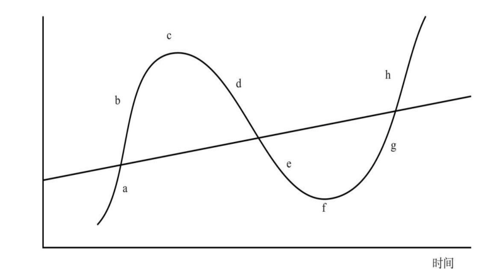

## 《周期》（霍华德·马克斯）

### 第1章 为什么投资要研究周期

作者开宗明义：我们是根本无法预知未来的“宏观面”会如何的，所谓的宏观面就是指未来的经济、市场、地缘政治等情况。

所以，有价值的研究应该投入到下面三个方面：

1. 基本面：包括行业基本面、公司基本面、证券基本面（帮助评估价值）
2. 市场面：支付的买入价格要合理（帮助评估价格）
3. 组合面：理解我们所处的投资环境（帮助决定投资组合布局）

投资需要做的是努力利用“价格”和“价值”的不匹配来获利，在评估价格、评估价值的基础上，构建并调整投资组合。调整投资组合，就需要观察投资环境中的很多因素在**周期**中所处的位置，以此为依据在合适的时间点上对投资组合进行“校准”。

---

“风险”的起源，本质上是我们并不知道未来会发生什么，不确定性是无法避免的。所以，我们应该把未来看成一系列由概率构成的区间。

研究周期的目的就是更好地判断未来可能的趋势，以此推断未来的概率分布。

### 第2章 周期的特征

周期，主要是指事物围绕中心点或者长期趋势上下波动的现象。 

* a：复苏阶段
* b：上涨阶段
* c：筑顶阶段
* d：反转阶段
* e：下跌阶段
* f：筑底阶段
* g：再次复苏阶段...

但并不是说周期就是一个事件接着一个事件地发生，而是一个事件引发下一个事件，其背后的**因果关系**才是核心的。

### 第3章 周期的规律

这一章主要在强调周期的规律性并不像自然科学那样精确，它受到很多因素的共同作用，其中带有很多随机性。

所以不能用机械的规律和模式去寻找周期，因为历史会重复，但不会简单地重复。

### 第4章 经济周期

经济周期是其它周期的基础，经济增长地快，企业盈利越可能扩张，股票等金融资产越可能升值……所以经济周期的观察很重要。

如今 GDP 是衡量一个国家经济产出的主要指标，它代表一个经济体生产的所有商品和服务的总价值。理论上它等于全民劳动生产率乘以工作总时间。

显然，劳动人口的增长与否是经济是否增长的一个重要方面，如果社会的人口收缩，那么实现经济增长就会困难。显然，人口的迁移也会影响劳动人口的数量。

另外，生产率和人均劳动时间是另一个重要方面，有很多因素会影响劳动生产率和劳动时间，比如教育、科技创新、自动化、全球化。

这些因素不会很快地改变，因此主要影响的是**长期**经济周期，可能是以几十年为长度的周期。

但由于心理、情绪、决策过程的影响，经济会围绕长期趋势上下波动形成**短期**经济周期。比如，经济向好的时候，各种资产升值，人们觉得自己更加富有了，所以更加勇于消费（“边际消费倾向”变高），这种行为就会影响经济，导致短期出现变化。

虽然人们非常努力想要预测经济周期，想以此作为投资决策的依据。但是，极少有人能持续做到预测正确。即使是专业人士，也是如此。

### 第5章 政府调节逆周期

如果经济太过强劲，那么通货膨胀就不可避免，未来经济的衰退就会更加猛烈；经济如果过于萎靡，那么企业盈利下滑、失业率上升，引起整个社会的萧条。既然经济有周期，那么为了防止经济周期走向极端，政府就需要进行逆周期调节。

政府干预经济的手段有很多，最重要的是通过中央银行和财政政策。

中央银行最重要的职责是控制通货膨胀，但是很多国家给央行另外一个重要职责是支持就业。这两个目标往往是冲突的。当经济上行促进就业时，往往通货膨胀也在上升，央行就要抑制过热的经济，从而削减就业。所以，央行要准确地把握周期的阶段，从而达到微妙的动态平衡。当然，这存在很大的难度。

而政府的财政政策不需要控制通货膨胀，而主要通过政府支出和收入（税收）来调节经济周期。凯恩斯主义认为政府应该通过影响需求来管理周期，当经济过热时，政府支出要低于财政收入，产生财政盈余，这相当于把部分资金抽离经济；而当经济不振时，通过加大政府支出形成赤字，相当于把资金注入经济。

### 第6章 企业盈利周期

企业的盈利周期主要受这几个因素影响：

1. 经济周期：经济上行还是下行对企业盈利非常重要，当然，不同的行业对于经济好坏的敏感度不同。
2. 企业杠杆：杠杆会放大经济对企业经营状况的影响。
3. 非经济因素：比如科技进步可能会削弱甚至消灭一些企业。

