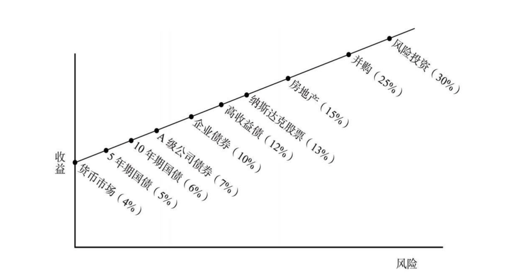

## 《周期》（霍华德·马克斯）

### 第1章 为什么投资要研究周期

作者开宗明义：我们是根本无法预知未来的“宏观面”会如何的，所谓的宏观面就是指未来的经济、市场、地缘政治等情况。

所以，有价值的研究应该投入到下面三个方面：

1. 基本面：包括行业基本面、公司基本面、证券基本面（帮助评估价值）
2. 市场面：支付的买入价格要合理（帮助评估价格）
3. 组合面：理解我们所处的投资环境（帮助决定投资组合布局）

投资需要做的是努力利用“价格”和“价值”的不匹配来获利，在评估价格、评估价值的基础上，构建并调整投资组合。调整投资组合，就需要观察投资环境中的很多因素在**周期**中所处的位置，以此为依据在合适的时间点上对投资组合进行“校准”。

---

“风险”的起源，本质上是我们并不知道未来会发生什么，不确定性是无法避免的。所以，我们应该把未来看成一系列由概率构成的区间。

研究周期的目的就是更好地判断未来可能的趋势，以此推断未来的概率分布。

### 第2章 周期的特征

周期，主要是指事物围绕中心点或者长期趋势上下波动的现象。 

* a：复苏阶段
* b：上涨阶段
* c：筑顶阶段
* d：反转阶段
* e：下跌阶段
* f：筑底阶段
* g：再次复苏阶段...

但并不是说周期就是一个事件接着一个事件地发生，而是一个事件引发下一个事件，其背后的**因果关系**才是核心的。

### 第3章 周期的规律

这一章主要在强调周期的规律性并不像自然科学那样精确，它受到很多因素的共同作用，其中带有很多随机性。

所以不能用机械的规律和模式去寻找周期，因为历史会重复，但不会简单地重复。

### 第4章 经济周期

经济周期是其它周期的基础，经济增长地快，企业盈利越可能扩张，股票等金融资产越可能升值……所以经济周期的观察很重要。

如今 GDP 是衡量一个国家经济产出的主要指标，它代表一个经济体生产的所有商品和服务的总价值。理论上它等于全民劳动生产率乘以工作总时间。

显然，劳动人口的增长与否是经济是否增长的一个重要方面，如果社会的人口收缩，那么实现经济增长就会困难。显然，人口的迁移也会影响劳动人口的数量。

另外，生产率和人均劳动时间是另一个重要方面，有很多因素会影响劳动生产率和劳动时间，比如教育、科技创新、自动化、全球化。

这些因素不会很快地改变，因此主要影响的是**长期**经济周期，可能是以几十年为长度的周期。

但由于心理、情绪、决策过程的影响，经济会围绕长期趋势上下波动形成**短期**经济周期。比如，经济向好的时候，各种资产升值，人们觉得自己更加富有了，所以更加勇于消费（“边际消费倾向”变高），这种行为就会影响经济，导致短期出现变化。

虽然人们非常努力想要预测经济周期，想以此作为投资决策的依据。但是，极少有人能持续做到预测正确。即使是专业人士，也是如此。

### 第5章 政府调节逆周期

如果经济太过强劲，那么通货膨胀就不可避免，未来经济的衰退就会更加猛烈；经济如果过于萎靡，那么企业盈利下滑、失业率上升，引起整个社会的萧条。既然经济有周期，那么为了防止经济周期走向极端，政府就需要进行逆周期调节。

政府干预经济的手段有很多，最重要的是通过中央银行和财政政策。

中央银行最重要的职责是控制通货膨胀，但是很多国家给央行另外一个重要职责是支持就业。这两个目标往往是冲突的。当经济上行促进就业时，往往通货膨胀也在上升，央行就要抑制过热的经济，从而削减就业。所以，央行要准确地把握周期的阶段，从而达到微妙的动态平衡。当然，这存在很大的难度。

而政府的财政政策不需要控制通货膨胀，而主要通过政府支出和收入（税收）来调节经济周期。凯恩斯主义认为政府应该通过影响需求来管理周期，当经济过热时，政府支出要低于财政收入，产生财政盈余，这相当于把部分资金抽离经济；而当经济不振时，通过加大政府支出形成赤字，相当于把资金注入经济。

### 第6章 企业盈利周期

企业的盈利周期主要受这几个因素影响：

1. 经济周期：经济上行还是下行对企业盈利非常重要，当然，不同的行业对于经济好坏的敏感度不同。
2. 企业杠杆：杠杆会放大经济对企业经营状况的影响。
3. 非经济因素：比如科技进步可能会削弱甚至消灭一些企业。

### 第7章 投资人心理和情绪钟摆

“市场在贪婪和恐惧之间来回波动”根本原因在于“投资人的心理和情绪在恐惧和贪婪之间来回摆动”。

投资成功的一个关键因素就是拒绝跟着感觉走，不过于情绪化。而大多数市场参与者的心理和情绪都会一起从一个极端到另一个极端移动，就像羊群成群结队地一起跑一样。

### 第8章 风险态度周期

投资高手的三个必需品质：

* 理解风险的能力突出
* 评估风险的能力突出
* 应对风险的能力突出

大家通常能够理解越高的风险必须要求更高的收益，这个过程形成了这样的资本市场线：

那么，如果大量投资人在觉得市场利好的时候，因为变得兴奋、乐观、贪婪而对风险溢价要求不那么高，那么上面的资本市场线的斜率就会变小。这个时候，相当于对风险资产期望的收益率降低，那么会导致风险资产的价格上涨。于是，导致风险资产的风险更高。

也就是说，当投资人都觉得风险低的时候，正是风险高的时候。与此类似，当投资人都觉得风险高的时候，资本市场线斜率变大，也就是实际风险小收益大的时候。

### 第9章 信贷周期

经济繁荣 → 信贷扩张 → 滥发贷款 → 产生重大损失 → 停止发放贷款 → 经济繁荣中止

在信贷周期变化时，信贷窗口通常是突然关闭的。对于企业来说，信贷窗口大开的时候，务必谨慎。

一个紧张不安、小心谨慎的信贷市场，其产生的原因、后续的发展、暗藏的真相，某种程度上告诉我们这是一个投资的好机会。

### 第10章 不良债权周期

风险规避型投资人要求发行高质量债券 → 低违约率 → 投资人对风险容忍度升高 → 投资人接受更多更低质量的债券 → 违约率上升 → 赔钱效应让投资人重回风险规避型

### 第11章 房地产周期

除了大多数金融周期的共性，房地产周期还有一个重要因素，就是开发周期长。由此带来以下特点：

* 从项目启动到建成销售，期间有长达数年的时间
* 房地产开发商一般会使用极高的财务杠杆 
* 房地产供给通常弹性很小

### 第12章 市场周期 -- 集周期于一身

如果证券价格只取决于公司的基本面，那么其波动就不会太大。但现实是，由于心理、情绪等其它非基本面的原因，证券价格的波动夸大了基本面的变化。

基本面、心理面、市场面三方面是互相影响，他们综合交织在一起，形成市场周期。

牛市三阶段理论，简单地描绘了投资人心理的变化：

* 少数特别有洞察力的人相信基本面会好转
* 大多数人都认识到，基本面确实好转了
* 每个人都觉得基本面将会变得更好，而且永远会更好

与此对应，熊市三阶段也类似。极端的牛市就是泡沫，极端的熊市就是崩盘。

总结一下市场周期的大致变化：

* 经济增长、经济数据利好
* 企业盈利高于预期
* 媒体到处是好消息
* 证券市场走强
* 投资人更加自信乐观
* 贪婪驱动投资人行为，低估风险、扩大投资
* 投资机会的需求超过供给
* 资产价格上涨，超过内在价值
* 资本市场宽松、融资容易、债务到期滚动融资容易
* 违约出现得很少
* 投资人怀疑程度降到低点，有风险的交易也能达成
* 每个人都认为事情会越来越好
* 投资人只担心错失机会
* 市场小幅下跌，投资人不但不生气，反而逢低买入
* 证券价格创新高
* 媒体欢呼
* 投资人盲目兴奋，买得更多
* 站在旁边一直不敢买得人，看着朋友发财后悔不已，最终投降，跟风追涨
* 预期收益下降，甚至降为负
* 风险升到高点
* 此时，投资人应当只担心亏损，应当非常谨慎小心
* -------
* 开始进入市场下行阶段
* 经济增长放缓
* 企业盈利持平或下跌，且低于预期
* 媒体到处是坏消息
* 证券市场疲软
* 投资人变得担心和沮丧
* 大家觉得到处是风险
* 恐惧主导了投资人心理
* 投资机会的需求低于供给
* 资产价格下跌到内在价值以下
* 资本市场大门猛然关闭、融资困难、通过债务到期滚动融资也困难
* 债务违约率飙升
* 投资人的怀疑程度升到高点，只有非常安全的交易才能达成
* 每个人都认为情况只会越来越糟糕
* 投资人唯一担心的就是会亏钱
* 卖出的人数超过买入的人数
* 价格创出新低
* 媒体关注这种令人沮丧的趋势
* 投资人变得沮丧和恐慌
* 持有证券的投资人觉得自己好傻
* 拒绝跟风、卖掉股票的投资人觉得自己太英明了
* 本来持有股票的人放弃了，以令人沮丧的价格割肉卖出，结果让股价进一步下跌
* 大跌之后，股价蕴含的预期收益上升
* 风险很低
* 此时，投资人应当担心错过赚钱的机会，应当进行进攻型投资

### 第13章 如何应对市场周期

应对周期，关键在于我们要知道现在投资人的心理周期和估值水平周期的钟摆摆到了什么位置。

比如助推市场大涨的因素，都从估值指标上反映出来了：股票市盈率、债券收益率、房地产的资本化率等等，都能进行量化分析。

此外，仔细留意投资人现在的行为，也可以帮助我们判断周期的位置。

识别市场周期是否过头，最好的方式就是分析真实的案例，看历史上周期走到极端的时候发生了什么。

人们在金融投资上的记忆极其短暂，同样的或者相似的情形再次出现，有时距离上次发生才过了短短几年，却受到新一代投资人的一片欢呼，新一代投资人通常很年轻，非常自信，称现在是卓越的重大创新，会改变世界和经济，却不知道这种事情在历史上造成了金融大灾难。

### 第14章 市场周期与投资布局

研究周期，就是研究如何布局投资组合，从而能妥善应对接下来可能发生的事件。

投资成功，应当考虑下面三对要素：

* 周期定位 & 资产选择
* 激进 & 保守
* 技能 & 运气

卓越的投资人的标志是不对称业绩，在市场上涨的时候仓位更重，在市场下跌的时候仓位更轻，同时也能选择较好的资产。

### 第15章 应对周期有局限性

周期定位，定准位置，很不容易！

### 第16章 成功本身也有周期

即使最优秀的投资人，也不会总成功不失败。

投资人的心态在谦卑和自信之间的关系很复杂。

市场上流行的东西一定不会便宜。如果一种投资策略非常流行，那么赚钱机会就会减少（过去的成功会导致未来的成功变得不大可能）。

公司的发展有周期、甚至国家的成功也有周期……

### 第17章 周期的未来

人是有感觉的，会把情绪和性格的弱点带进经济决策和投资决策中。这个世界本质是人参与的，所以不能机械性地考虑其运作，而要充分考虑情绪在周期发挥着作用。

人容易走极端，永远不会停止，因此这些极端最终必然得到修正。